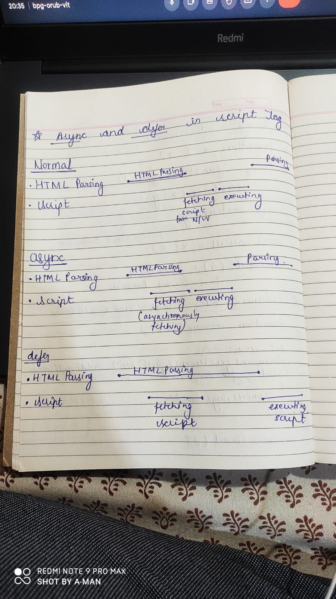

## ~ Emmmet

- It is a free add on to your editor, that allows you to write shortcut that expanded into full pieces of code.

## ~ Difference between Library and Framework

- Technical Difference: Inversion of control
- Library: Control is in hand of developer ( React JS)
- Framework: Control is in hand of framework itself ( vue-form-generator)

## ~ Crossorigin

- It sets the mode of request to https CORS request.
- Cross origin request is request for a resource (e.g. style sheets, iframes, images, fonts, or scripts) from another domain.

## ~ CDN

- Content Delivery/Distribution Network
- It is a network of interconnected servers.
- It is present closer geographically to the user than actual servers to speed up content delivery.
- Useful for decreasing latency, increasing efficiency and enriching user experiences.

## ~ Difference between React and React DOM.

- React is library used for creating UI.
- ReactDOM is library used for rending UI on browser created through React.

## ~ Diff between react.development.js & react.production.js files via CDN?

- react.production.js is minified and optimized version of react.development.js

## ~ Asyn vs Defer

## 
